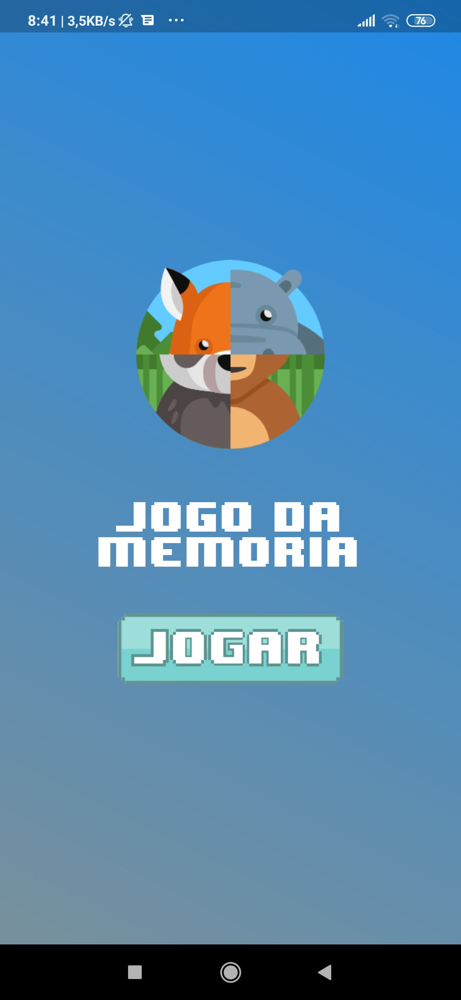
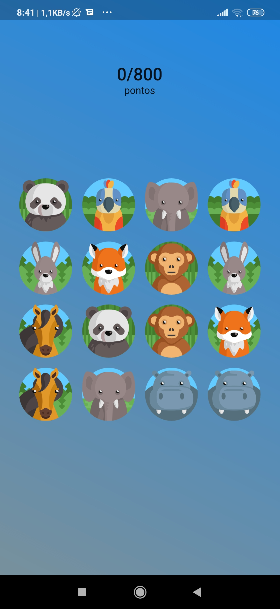
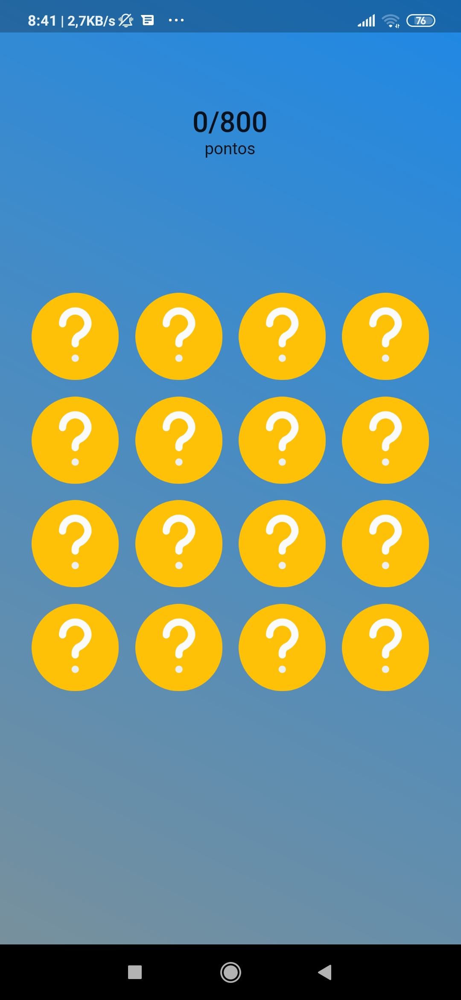

# memory card game with flutter

A new Flutter project.

# description

This project is a copy of youtube memory card game tutorial.

creator: Sanskar Tiwari.

video links: 

- [tutorial part 1](https://www.youtube.com/watch?v=vfF0-hZaKNM&t=2s)
- [tutorial part 2](https://www.youtube.com/watch?v=n2dHKfMttOU)

## Some Screenshots

## Getting Started

This project is a starting point for a Flutter application.

A few resources to get you started if this is your first Flutter project:

- [Lab: Write your first Flutter app](https://flutter.dev/docs/get-started/codelab)
- [Cookbook: Useful Flutter samples](https://flutter.dev/docs/cookbook)

For help getting started with Flutter, view our
[online documentation](https://flutter.dev/docs), which offers tutorials,
samples, guidance on mobile development, and a full API reference.
